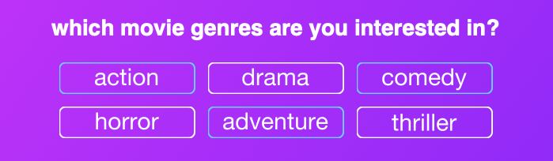

# Dinner and a Movie

For those indecisive moments when you just can't decide what to watch or what to eat. Dinner and a Movie let's you input the
streaming services that you subscribe to, the genre(s) of film that you might be interested in watching, and the desired 
price point of your meal. Your inputs are then used to make decisions for you! The app recommends a movie for you to watch 
and a nearby restaurant for you to order food from. Don't like your choices? Roll the dice again and see what you get.


### [Give it a go!](https://dinner-and-a-movie-gen.herokuapp.com)

## Simple and Clean UI

### Select your subscribed streaming services:


### Select the film genres you would like to see:



### Decide how much you'd like to spend on your meal:


### Hit the generate button and receive your suggestions!


## For Mobile and Desktop

The responsive design means that the app looks great and remains simple to use no matter what screen your on:


## The Tech

Dinner and a Movie uses a light backend infrastructure built with an Express framework and Node.js. The frontend and backend
work together to provide a seamless single-page experience.

Two APIs are responsible for delivering the film and local restaurant information that is then presented to the user. API
calls are performed in the background which allows the app to remain light and provide an uninterrupted user experience.

### Handling Randomness

Results are randomly selected based on the criteria that the user inputs. In order to provide relavent results, we need to
introduce randomness at two points:

- **First**, before the API calls:

```javascript
function getRandomSelection(streamSelections, genreSelections) {
  const streamListLength = streamSelections.length;
  const genreListLength = genreSelections.length;

  service = streamSelections[Math.floor(Math.random() * streamListLength)].value;
  genre = genreSelections[Math.floor(Math.random() * genreListLength)].value;
  
  return { service, genre };
}
```

- **Second**, after we receive information from the API:

```javascript
  async function callMovieApi(selections, postMovieInfo, revealLanding, hideLoader) {
  axios.post('/api/movies', { 
    "service": selections.service, "genre": selections.genre, "page": selections.page 
  }).then(function (response) {
    const result = response.data.results[Math.floor(Math.random() * response.data.results.length)];
    const title = result.title;
    const description = result.overview;
    const picture = result.posterURLs.original;
    const service = serviceName(selections.service);
    postMovieInfo({ title, description, picture, service })
  }).catch(function (error) {
    hideLoader();
    revealLanding();
    console.error(error);
  });
}
```

### Enjoy your decision-free evening!
